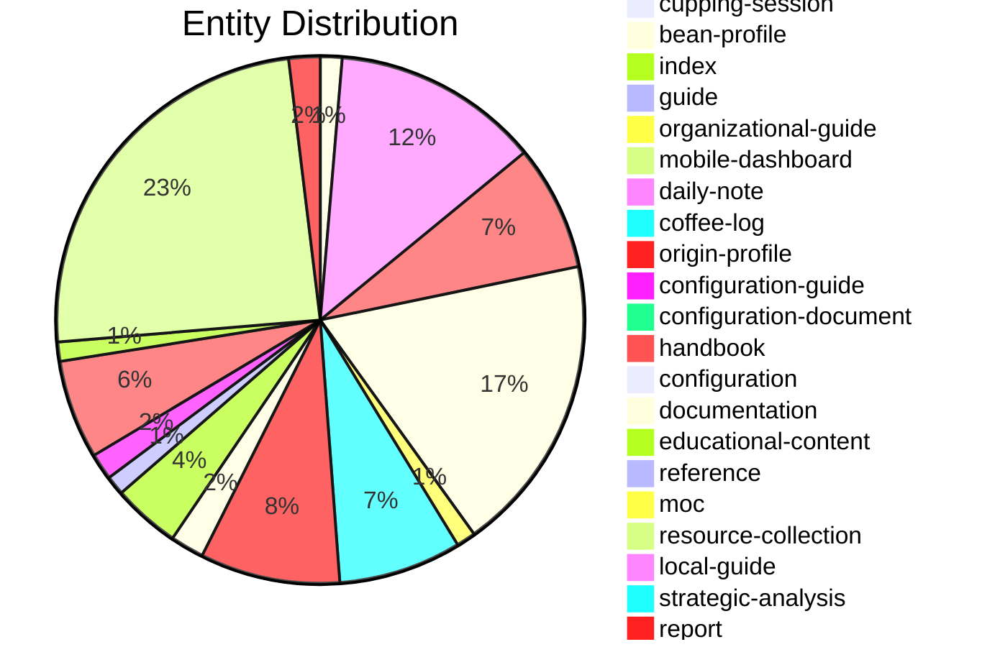

# Coffee Vault Daily Report

**Generated**: 11/6/2025 9:28:02 PM
**Vault Health Score**: 45/100 🔴 Critical

---

## 📊 Overview Statistics

| Metric | Count |
|--------|-------|
| Total Files | 911 |
| New Files (24h) | 0 |
| Modified Files (24h) | 911 |
| Broken Links | 4322 |
| Orphaned Files | 597 |

## 📚 Entity Distribution

| Entity Type | Count |
|-------------|-------|
| scientific-reference | 165 |
| bean-profile | 124 |
| parse-error | 121 |
| roaster-profile | 86 |
| origin-profile | 58 |
| unknown | 57 |
| equipment-model | 52 |
| coffee-log | 51 |
| brewing-guide | 41 |
| educational-content | 28 |
| documentation | 14 |
| analytics-dashboard | 13 |
| coffee-goal | 11 |
| dashboard | 9 |
| organizational-guide | 8 |
| reference | 8 |
| database-view | 8 |
| collection-guide | 5 |
| guide | 4 |
| configuration-guide | 4 |
| coffee-event | 4 |
| workspace-index | 4 |
| persona-dashboard | 3 |
| cupping-session | 3 |
| configuration-document | 3 |
| bean-library | 3 |
| plugin-configuration | 3 |
| producer-profile | 2 |
| getting-started | 1 |
| quick-reference | 1 |
| directory-guide | 1 |
| ux-research | 1 |
| coffee-quick | 1 |
| monthly-report | 1 |
| equipment-maintenance | 1 |
| index | 1 |
| mobile-dashboard | 1 |
| daily-note | 1 |
| handbook | 1 |
| configuration | 1 |
| moc | 1 |
| resource-collection | 1 |
| local-guide | 1 |
| strategic-analysis | 1 |
| report | 1 |
| reference-view | 1 |
| graph-view | 1 |

## ✏️ Modified Files (Last 24 Hours)

- VAULT-EXPANSION-STRATEGY.md
- START-HERE.md
- README.md
- HOME-DASHBOARD.md
- HOME-DASHBOARD-v5.md
- COFFEE-VAULT-QUICK-REFERENCE.md
- CLAUDE-VAULT-NEXTGEN-PROMPT.md
- CLAUDE-VAULT-EXPANSION-PROMPT.md
- Visualizations/README.md
- Views/Persona-PROFESSIONAL-Dashboard.md

*...and 901 more*

## 🎯 Coverage Metrics

### Beans With Origins

🟩🟩🟩🟩🟩🟩🟩🟩🟩🟩 100%

124 of 124 linked

### Beans With Roasters

🟩⬜⬜⬜⬜⬜⬜⬜⬜⬜ 9%

11 of 124 linked

### Logs With Equipment

⬜⬜⬜⬜⬜⬜⬜⬜⬜⬜ 0%

0 of 51 linked

### Recipes With Equipment

⬜⬜⬜⬜⬜⬜⬜⬜⬜⬜ 0%

0 of 0 linked

## 🔗 Orphaned Files (No Incoming Links)

- VAULT-EXPANSION-STRATEGY.md
- HOME-DASHBOARD-v5.md
- COFFEE-VAULT-QUICK-REFERENCE.md
- CLAUDE-VAULT-NEXTGEN-PROMPT.md
- CLAUDE-VAULT-EXPANSION-PROMPT.md
- Views/Persona-PROFESSIONAL-Dashboard.md
- Views/Persona-NOVICE-Dashboard.md
- Views/Persona-ENTHUSIAST-Dashboard.md
- UX/UX-RESEARCH-SUMMARY.md
- Scientific References/00-Scientific Content Index.md
- Scripts/AUTOMATION_MODULES_README.md
- Reviews & Articles/_README - How to Organize Research.md
- Roasters/Verve-Coffee-Roasters-Profile.md
- Roasters/Trabocca-Netherlands-Profile.md
- Roasters/The-Coffee-Collective-Profile.md

*...and 582 more*

## ✅ Action Items

### 🔴 High Priority

- [ ] Fix 4322 broken wikilink(s)

### 🟡 Medium Priority

- [ ] Review and link 597 orphaned files

---

*Generated by Coffee Vault Daily Report Generator v1.0.0*
*Next report: 11/7/2025*
