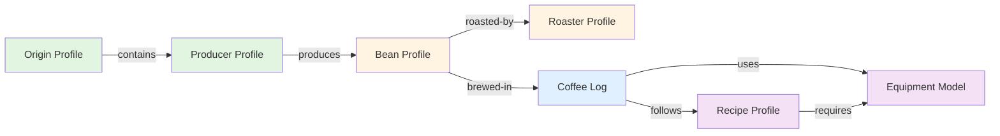
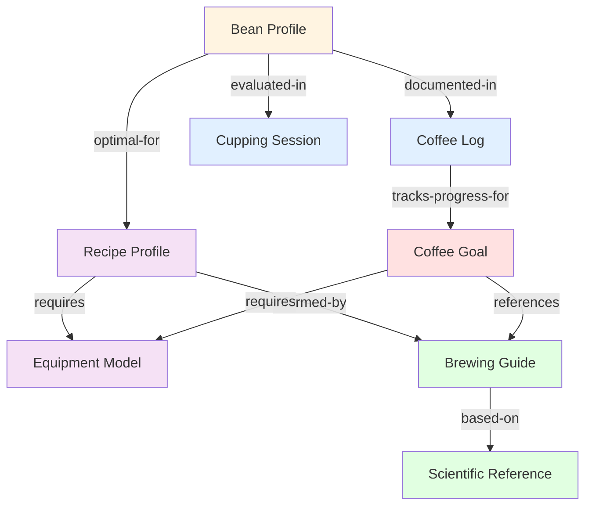
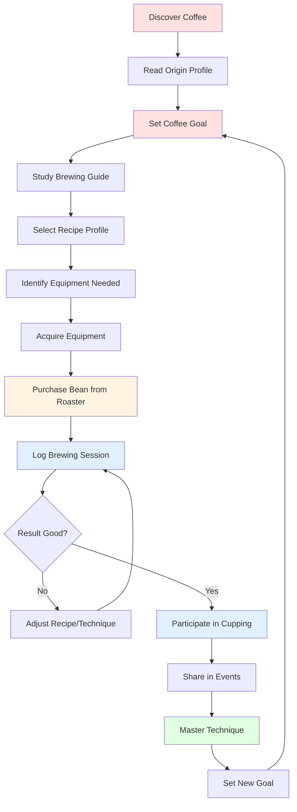
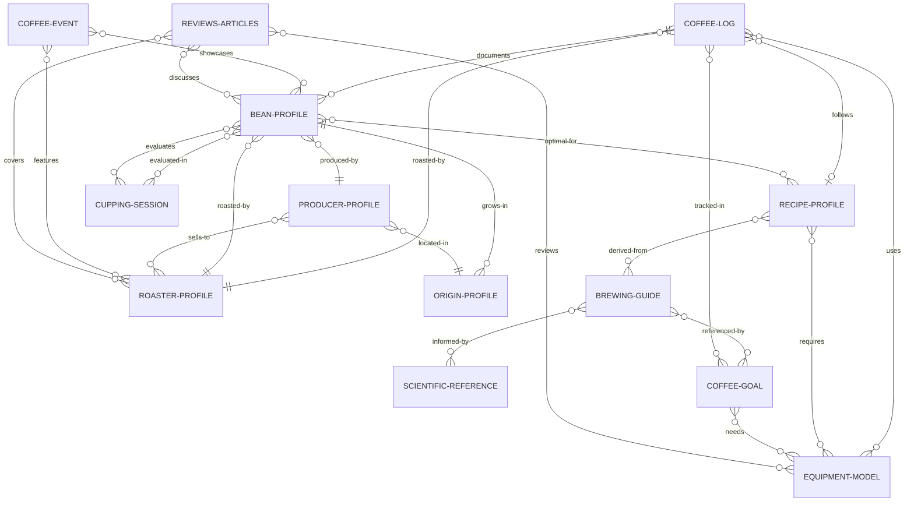

# Coffee Vault Ontology & Information Architecture

**Version**: 1.0
**Last Updated**: 2025-11-06
**Status**: Comprehensive Documentation

This document defines the complete information architecture, entity types, relationships, naming conventions, and validation rules for the Coffee Vault knowledge management system.

---

## Table of Contents

1. [Overview](#overview)
2. [Entity Type Catalog](#entity-type-catalog)
3. [Relationship Mappings](#relationship-mappings)
4. [Entity Relationship Diagrams](#entity-relationship-diagrams)
5. [Naming Conventions](#naming-conventions)
6. [Validation Rules](#validation-rules)
7. [Directory Structure](#directory-structure)
8. [Frontmatter Standards](#frontmatter-standards)

---

## Overview

### Purpose

The Coffee Vault Ontology defines the semantic structure of coffee knowledge, establishing:
- **Entity types** and their purposes
- **Relationships** between entities
- **Naming standards** for consistency
- **Validation rules** for data quality
- **Organizational patterns** for information architecture

### Design Principles

1. **Clarity**: Every entity has a clear, singular purpose
2. **Consistency**: Standardized naming and structure across all entities
3. **Connectivity**: Rich linking between related entities
4. **Completeness**: Comprehensive metadata for discovery and analysis
5. **Flexibility**: Extensible structure for future growth

### Core Entity Categories

```
├── Transactional Entities (Events/Logs)
│   ├── Coffee Logs (daily brewing records)
│   ├── Cupping Sessions (formal tastings)
│   └── Coffee Events (industry events)
│
├── Reference Entities (Knowledge Base)
│   ├── Bean Profiles (individual coffees)
│   ├── Origin Profiles (geographic regions)
│   ├── Producer Profiles (farms/cooperatives)
│   ├── Roaster Profiles (roasting companies)
│   ├── Equipment Models (gear specifications)
│   └── Recipe Profiles (brewing methods)
│
├── Educational Entities (Learning)
│   ├── Brewing Guides (method tutorials)
│   ├── Scientific References (research)
│   └── Reviews & Articles (external content)
│
├── Planning Entities (Goals)
│   └── Coffee Goals (learning objectives)
│
└── Organizational Entities (Structure)
    ├── Workspaces (workflow hubs)
    ├── Analytics (data dashboards)
    └── Templates (document templates)
```

---

## Entity Type Catalog

### 1. Coffee Logs

**Purpose**: Record individual coffee brewing sessions with parameters, outcomes, and tasting notes.

**Location**: `/Coffee Logs/`

**Naming Convention**: `YYYY-MM-DD-Bean-Name-Sequential-Number.md`
**Example**: `2025-08-14-Ethiopian-Yirgacheffe-9.md`

**Required Frontmatter**:
```yaml
type: coffee-log
date: YYYY-MM-DD
time: HH:MM
beans: Bean Name
roaster: Roaster Name
origin: Country/Region
roast-level: light|medium|medium-dark|dark
brew-method: method-name
grind-size: coarse|medium-coarse|medium|medium-fine|fine
dose: number (grams)
water: number (grams/ml)
brew-ratio: 1:XX
water-temperature: number (celsius)
brew-time: MM:SS
rating: X.X (0.0-5.0)
cups-brewed: number
status: active|archived
tags: [coffee-log, YYYY-MM]
```

**Optional Frontmatter**:
```yaml
flavor-notes: [array of flavor descriptors]
equipment-used: [[Equipment Name]]
recipe-followed: [[Recipe Name]]
would-rebuy: true|false
notes: text
mood: text
time-of-day: morning|afternoon|evening
extraction-yield: percentage
tds: percentage
```

**Relationships**:
- `brewed-from` → Bean Profile
- `roasted-by` → Roaster Profile
- `from-origin` → Origin Profile
- `used-equipment` → Equipment Model(s)
- `followed-recipe` → Recipe Profile

---

### 2. Bean Profiles

**Purpose**: Document specific coffee beans with origin, processing, and flavor characteristics.

**Location**: `/Bean Library/` or `/Beans Library/`

**Naming Convention**: `Country-Region-Variety-Processing.md`
**Example**: `Ethiopia-Yirgacheffe-Gedeb-Natural.md`

**Required Frontmatter**:
```yaml
type: bean-profile
name: Full Bean Name
origin: [[Country]] or [[Country-Region]]
region: Specific Region
country: Country Name
varietal: Variety name(s)
processing: washed|natural|honey|experimental
roaster: [[Roaster Name]]
roast-level: light|medium|medium-dark|dark
altitude: XXXX-XXXX (MASL)
harvest-year: YYYY
status: active|finished|archived
tags: [bean-profile, origin, variety, processing]
```

**Optional Frontmatter**:
```yaml
producer: [[Producer Name]]
farm-name: Farm Name
lot-number: text
grade: Grade classification
certification: [organic, fair-trade, etc.]
price-paid: amount
purchase-date: YYYY-MM-DD
bag-size: amount (grams/kg)
roast-date: YYYY-MM-DD
taste-notes: [array]
cupping-score: XX
```

**Relationships**:
- `grown-at` → Origin Profile
- `produced-by` → Producer Profile
- `roasted-by` → Roaster Profile
- `featured-in` → Coffee Log(s)
- `similar-to` → Other Bean Profiles

---

### 3. Origin Profiles

**Purpose**: Comprehensive documentation of coffee-producing regions including terroir, history, and characteristics.

**Location**: `/Origins/`

**Naming Convention**: `Country-Region.md` or `Country.md`
**Example**: `Ethiopia-Yirgacheffe.md`, `Colombia.md`

**Required Frontmatter**:
```yaml
type: origin-profile
country: Country Name
region: Region Name (if specific)
coffee-rank: specialty|premium|commercial
altitude: XXXX-XXXX (MASL)
annual-production: amount-metric-tons
primary-process: washed|natural|honey
secondary-process: alternative methods
primary-varieties: variety names
tags: [origin, country, region, continent]
```

**Optional Frontmatter**:
```yaml
climate: description
soil-type: description
rainfall: annual amount
temperature-range: XX-XX°C
harvest-season: months
notable-producers: [array]
flavor-profile: typical characteristics
history: historical notes
certifications-common: [array]
```

**Relationships**:
- `contains` → Producer Profiles (in this region)
- `grows` → Bean Profiles (from this origin)
- `part-of` → Parent Origin (country/continent)
- `similar-to` → Other Origins

---

### 4. Producer Profiles

**Purpose**: Document coffee farms, cooperatives, and washing stations with production details and practices.

**Location**: `/Producers/`

**Naming Convention**: `Producer-Name-Country.md`
**Example**: `Kayon-Mountain-Farm-Ethiopia.md`

**Required Frontmatter**:
```yaml
type: producer-profile
producer-name: Full Name
country: [[Origins/Country]]
region: [[Origins/Region]]
type: family-farm|cooperative|estate|washing-station
established: YYYY
varieties: variety names
processing-methods: [methods]
certifications: [certifications]
annual-production: scale (small|medium|large)
altitude: XXXX-XXXX-MASL
harvest-season: months
status: complete|active
tags: [producer-profile, country, type]
date: YYYY-MM-DD
```

**Optional Frontmatter**:
```yaml
owner: Name
size: hectares
member-count: number (for cooperatives)
sustainability-practices: [practices]
direct-trade: true|false
website: URL
coordinates: lat, long
```

**Relationships**:
- `located-in` → Origin Profile
- `produces` → Bean Profiles
- `sells-to` → Roaster Profiles
- `processes-at` → Washing Station (if different)

---

### 5. Roaster Profiles

**Purpose**: Document coffee roasting companies, their philosophy, and roasting approach.

**Location**: `/Roasters/`

**Naming Convention**: `Roaster-Name.md` or `Roaster-Name-Profile.md`
**Example**: `Onyx-Coffee-Lab.md`

**Required Frontmatter**:
```yaml
type: roaster-profile
name: Roaster Name
location: City, State/Province, Country
founded: YYYY
founders: [array of names]
roasting-style: light|medium|dark|varied
sourcing-model: direct-trade|fair-trade|conventional
annual-production: small|medium|large
cafes: description
wholesale: yes|no|selective
online-sales: yes|no
sustainability-focus: low|medium|high|very-high
transparency-level: low|medium|high|exceptional
market-position: description
status: active|defunct
tags: [roaster-profile, location, style]
```

**Optional Frontmatter**:
```yaml
signature-approach: description
certifications: [array]
notable-coffees: [array]
roasting-equipment: [array]
competition-presence: description
ownership: independent|corporate
community-rating: X.X/5
website: URL
```

**Relationships**:
- `roasts` → Bean Profiles
- `sources-from` → Producer Profiles
- `featured-in` → Coffee Logs
- `competes-in` → Coffee Events

---

### 6. Recipe Profiles

**Purpose**: Define specific brewing recipes with parameters, techniques, and success metrics.

**Location**: `/Recipes/`

**Naming Convention**: `Method-Descriptor-Recipe.md`
**Example**: `V60-Light-Ethiopian-Recipe.md`

**Required Frontmatter**:
```yaml
type: recipe-profile
name: Recipe Name
brew-method: method-name
created-date: YYYY-MM-DD
recipe-author: Name
recipe-source: personal|adapted|original-author
status: active|testing|archived
version: X
times-used: number
success-rate: percentage
avg-rating: X.X
tags: [recipe-profile, brew-method, coffee-type]
```

**Optional Frontmatter**:
```yaml
relationships:
  requires: [[Equipment-Maintenance-Log]], [[Equipment-Maintenance-Log]]
  works-with: [[Bean Type]]
difficulty: easy|intermediate|advanced
target-profile: flavor description
dose: grams
water: grams
ratio: 1:XX
grind-size: setting
temperature: celsius
brew-time: MM:SS
```

**Relationships**:
- `requires` → Equipment Model(s)
- `optimal-for` → Bean Profiles/Origins
- `followed-in` → Coffee Logs
- `derived-from` → Other Recipes
- `variation-of` → Base Recipe

---

### 7. Equipment Models

**Purpose**: Comprehensive specifications and reviews of coffee equipment.

**Location**: `/Equipment Models/`

**Naming Convention**: `Brand-Model-Name.md`
**Example**: `Hario-V60-Plastic-Dripper.md`

**Required Frontmatter**:
```yaml
type: equipment-model
name: Full Model Name
brand: Brand Name
model-number: Model ID
category: grinder|brewer|scale|kettle|espresso-machine
release-year: YYYY
status: active|discontinued
tags: [equipment-model, brand, category]
```

**Optional Frontmatter**:
```yaml
price-range: $XX-$XX
community-rating: X.X/5
owned: true|false
ownership-status: owned|wishlist|researching
purchase-date: YYYY-MM-DD
purchase-price: amount
size: dimensions
weight: amount
power: watts
capacity: amount
warranty: duration
```

**Relationships**:
- `used-in` → Coffee Logs
- `required-by` → Recipe Profiles
- `compatible-with` → Other Equipment
- `alternative-to` → Similar Equipment

---

### 8. Cupping Sessions

**Purpose**: Record formal coffee tasting sessions using standardized protocols.

**Location**: `/Cupping Sessions/`

**Naming Convention**: `YYYY-MM-DD-Session-Description.md`
**Example**: `2025-10-28-Ethiopian-Comparison-Cupping.md`

**Required Frontmatter**:
```yaml
type: cupping-session
date: YYYY-MM-DD
protocol: SCA|COE|custom
session-type: comparison|evaluation|competition|training
location: Location Name
participant-count: number
sample-count: number
status: completed|planned
tags: [cupping-session, type, YYYY-MM]
```

**Optional Frontmatter**:
```yaml
participants: [array of names]
blind: true|false
water-temp: celsius
water-tds: ppm
room-temp: celsius
cupper-levels: beginner|intermediate|advanced
notes: session notes
```

**Relationships**:
- `evaluated` → Bean Profiles
- `attended-by` → Participants
- `used-protocol` → Scientific Reference
- `compared` → Multiple Beans

---

### 9. Coffee Events

**Purpose**: Document industry events, competitions, and coffee-related gatherings.

**Location**: `/Coffee Events/`

**Naming Convention**: `YYYY-MM-Event-Name.md` or `Event-Name-YYYY.md`
**Example**: `World-Barista-Championship-2024.md`

**Required Frontmatter**:
```yaml
type: coffee-event
name: Event Name
date: YYYY-MM-DD or date range
event-type: competition|expo|cupping|workshop|conference
location: City, Country
status: upcoming|completed|past
tags: [coffee-event, event-type, YYYY]
```

**Optional Frontmatter**:
```yaml
organizer: Organization Name
participants: number or array
winners: [array]
notable-moments: description
attendance: number
website: URL
cost: amount
attended: true|false
```

**Relationships**:
- `featured` → Roaster Profiles (competitors/exhibitors)
- `showcased` → Bean Profiles (competition coffees)
- `hosted-by` → Organization
- `attended-by` → People

---

### 10. Coffee Goals

**Purpose**: Track personal coffee learning objectives and progress.

**Location**: `/Coffee Goals/`

**Naming Convention**: `Goal-Description.md`
**Example**: `Master-V60-Technique.md`

**Required Frontmatter**:
```yaml
type: coffee-goal
goal-type: learn-technique|acquire-equipment|visit-origin|achievement
target-date: YYYY-MM-DD
status: planning|in-progress|completed|abandoned
created-date: YYYY-MM-DD
priority: low|medium|high
progress-percentage: XX
tags: [coffee-goal, goal-type, category]
```

**Optional Frontmatter**:
```yaml
milestones: [array of checkpoints]
related-resources: [[links]]
practice-sessions: number
budget: amount
deadline: YYYY-MM-DD
motivation: text
```

**Relationships**:
- `requires` → Equipment Models
- `uses` → Recipe Profiles
- `practices-with` → Bean Profiles
- `references` → Brewing Guides
- `tracked-in` → Coffee Logs

---

### 11. Brewing Guides

**Purpose**: Educational tutorials for coffee brewing methods and techniques.

**Location**: `/Brewing Guides/`

**Naming Convention**: `Method-Name-Guide.md` or `Technique-Description.md`
**Example**: `Pour-Over-V60-Guide.md`

**Required Frontmatter**:
```yaml
type: brewing-guide
brew-method: method name
difficulty: beginner|intermediate|advanced
source: Original Author/Source
date-created: YYYY-MM-DD
tags: [brewing-guide, brew-method, difficulty]
```

**Optional Frontmatter**:
```yaml
time-required: minutes
equipment-needed: [array]
best-for: coffee types
video-url: URL
author: Name
version: X.X
```

**Relationships**:
- `requires` → Equipment Models
- `creates` → Recipe Profiles
- `referenced-by` → Coffee Goals
- `used-in` → Coffee Logs

---

### 12. Scientific References

**Purpose**: Curated research, papers, and technical documentation about coffee science.

**Location**: `/Scientific References/`

**Subdirectories**:
- `/Agronomy/`
- `/Brewing Science/`
- `/Coffee Chemistry/`
- `/Extraction Science/`
- `/Processing/`
- `/Roasting/`
- `/Sensory Science/`
- `/Water Chemistry/`
- `/Grinding/`

**Naming Convention**: `Topic-Title.md`
**Example**: `Retronasal-Olfaction-and-Flavor-Perception.md`

**Required Frontmatter**:
```yaml
type: scientific-reference
category: agronomy|brewing|chemistry|extraction|processing|roasting|sensory|water|grinding
title: Full Title
date: YYYY-MM-DD (publication or added)
tags: [scientific-reference, category, topic]
```

**Optional Frontmatter**:
```yaml
author: [array of authors]
publication: Journal/Source
doi: identifier
url: link
key-findings: [array]
practical-applications: description
difficulty-level: beginner|intermediate|advanced
```

**Relationships**:
- `informs` → Brewing Guides
- `supports` → Recipe Profiles
- `explains` → Coffee phenomena
- `cited-by` → Other References

---

### 13. Reviews & Articles

**Purpose**: External content, professional reviews, and coffee journalism.

**Location**: `/Reviews & Articles/`

**Subdirectories**:
- `/Brewing Tutorials/`
- `/Equipment/`
- `/Industry News/`
- `/Professional Reviews/`
- `/Science & Research/`

**Naming Convention**: `Publication-Title.md` or `Topic-Description.md`

**Required Frontmatter**:
```yaml
type: article|review|tutorial|news
category: brewing|equipment|industry|science
title: Article Title
author: Author Name
source: Publication/Website
date: YYYY-MM-DD
tags: [article-type, category]
```

**Optional Frontmatter**:
```yaml
url: link
rating: X.X/5
summary: brief description
key-points: [array]
related-gear: [[Equipment-Maintenance-Log]]
related-beans: [[Bean Profile]]
```

**Relationships**:
- `reviews` → Equipment Models, Bean Profiles, Roasters
- `discusses` → Techniques, Origins, Events
- `cites` → Scientific References

---

### 14. Workspaces

**Purpose**: Organizational hubs for specific workflow areas.

**Location**: `/Workspaces/`

**Types**:
- `/Daily-Brewing/` - Daily coffee preparation
- `/Supply-Chain/` - Origin-to-cup tracking
- `/Analytics-Analysis/` - Data analysis
- `/Learning-Education/` - Knowledge building

**Naming Convention**: `Workspace-Name/INDEX.md`

**Required Frontmatter**:
```yaml
type: workspace
name: Workspace Name
purpose: description
tags: [workspace, category]
```

---

### 15. Analytics Dashboards

**Purpose**: Data visualization and analysis views.

**Location**: `/Analytics/`

**Subdirectories by workspace type**

**Naming Convention**: `N-Dashboard-Name.md` (numbered)

**Required Frontmatter**:
```yaml
type: analytics-dashboard
name: Dashboard Name
category: analytics-type
tags: [analytics, category]
```

---

### 16. Templates

**Purpose**: Standardized document templates for creating new entities.

**Location**: `/Templates/`

**Available Templates**:
- `Bean Profile.md`
- `Brewing Guide.md`
- `Coffee Event.md`
- `Coffee Goal.md`
- `Coffee Log.md` (multiple versions)
- `Cupping Session.md`
- `Equipment Model.md`
- `Producer Profile.md`
- `Recipe Profile.md`
- `Roaster Profile.md`
- `SCA-Cupping-Form.md`

---

## Relationship Mappings

### Primary Relationships

#### Supply Chain Relationships

```
Origin → Producer → Roaster → Bean → Coffee Log
```

**grows-in**: Bean Profile → Origin Profile
- Definition: Geographic origin where coffee is grown
- Cardinality: Many-to-One (many beans from one origin)
- Example: [[Ethiopia-Yirgacheffe-Gedeb-Natural]] `grows-in` [[Ethiopia-Yirgacheffe]]

**produced-by**: Bean Profile → Producer Profile
- Definition: Farm/cooperative that produced the coffee
- Cardinality: Many-to-One
- Example: [[Ethiopia]] `produced-by` [[Kayon-Mountain-Farm-Ethiopia]]

**roasted-by**: Bean Profile → Roaster Profile
- Definition: Company that roasted the coffee
- Cardinality: Many-to-One
- Example: [[Panama]] `roasted-by` [[Onyx-Coffee-Lab]]

**located-in**: Producer Profile → Origin Profile
- Definition: Geographic location of producer
- Cardinality: Many-to-One
- Example: [[Kayon-Mountain-Farm-Ethiopia]] `located-in` [[Ethiopia-Guji]]

---

#### Brewing & Usage Relationships

**brewed-as**: Bean Profile → Recipe Profile
- Definition: Recommended or used brewing methods
- Cardinality: Many-to-Many
- Example: [[Ethiopia-Yirgacheffe]] `brewed-as` [[V60-Light-Ethiopian-Recipe]]

**uses-equipment**: Recipe Profile → Equipment Model
- Definition: Equipment required for recipe
- Cardinality: Many-to-Many
- Example: [[V60-Light-Ethiopian-Recipe]] `uses` [[Hario-V60-Plastic-Dripper]]

**measured-by**: Coffee Log → Equipment Model
- Definition: Equipment used in brewing session
- Cardinality: Many-to-Many
- Example: [2025-08-14-Ethiopian-Yirgacheffe-9] `measured-by` [[Acaia-Pearl-Scale]]

**documents**: Coffee Log → Bean Profile
- Definition: Log records brewing experience with specific bean
- Cardinality: Many-to-One
- Example: [2025-08-14-Ethiopian-Yirgacheffe-9] `documents` [[Ethiopia-Yirgacheffe-Gedeb-Natural]]

---

#### Knowledge & Learning Relationships

**references**: Scientific Reference → Multiple Entity Types
- Definition: Research that informs practice
- Cardinality: Many-to-Many
- Example: [[Retronasal-Olfaction]] `references` [[SCA-Cupping-Protocol]]

**informs**: Scientific Reference → Brewing Guide
- Definition: Research that shapes techniques
- Cardinality: Many-to-Many
- Example: [[Espresso-Extraction-Science]] `informs` [[Pour-Over-V60-Guide]]

**requires-knowledge**: Coffee Goal → Brewing Guide
- Definition: Educational resources needed for goal
- Cardinality: Many-to-Many
- Example: [[Master-Espresso-Extraction]] `requires-knowledge` [[Espresso-Guide]]

**practices-with**: Coffee Goal → Bean Profile/Equipment
- Definition: Resources used to achieve goal
- Cardinality: Many-to-Many
- Example: [[Master-V60-Technique]] `practices-with` [[Hario-V60-Plastic-Dripper]]

---

#### Evaluation Relationships

**evaluated-in**: Bean Profile → Cupping Session
- Definition: Bean formally tasted in cupping
- Cardinality: Many-to-Many
- Example: [[Ethiopia]] `evaluated-in` [[2025-10-28-Ethiopian-Comparison-Cupping]]

**compared-to**: Bean Profile → Bean Profile
- Definition: Direct comparison between coffees
- Cardinality: Many-to-Many
- Example: [[Ethiopia]] `compared-to` [[Ethiopia]]

**reviewed-in**: Multiple Entities → Reviews & Articles
- Definition: External coverage/review
- Cardinality: Many-to-Many
- Example: [[Onyx-Coffee-Lab]] `reviewed-in` [[Sprudge-Onyx-Profile]]

---

#### Event & Community Relationships

**participated-in**: Roaster Profile → Coffee Event
- Definition: Roaster competed or exhibited at event
- Cardinality: Many-to-Many
- Example: [[Onyx-Coffee-Lab]] `participated-in` [[World-Barista-Championship-2024]]

**featured**: Coffee Event → Bean Profile
- Definition: Coffee showcased at event
- Cardinality: Many-to-Many
- Example: [[Cup-of-Excellence-Ethiopia-2024]] `featured` [[Ethiopia]]

---

### Relationship Cardinality Summary

| Relationship | From → To | Cardinality | Bidirectional |
|--------------|-----------|-------------|---------------|
| grows-in | Bean → Origin | Many-to-One | Yes (contains) |
| produced-by | Bean → Producer | Many-to-One | Yes (produces) |
| roasted-by | Bean → Roaster | Many-to-One | Yes (roasts) |
| located-in | Producer → Origin | Many-to-One | Yes (contains) |
| brewed-as | Bean → Recipe | Many-to-Many | Yes (optimal-for) |
| uses-equipment | Recipe → Equipment | Many-to-Many | Yes (required-by) |
| documents | Log → Bean | Many-to-One | Yes (logged-in) |
| evaluated-in | Bean → Cupping | Many-to-Many | Yes (evaluated) |
| informs | Reference → Guide | Many-to-Many | Yes (based-on) |
| requires | Goal → Resource | Many-to-Many | Yes (needed-for) |

---

## Entity Relationship Diagrams

### Primary Supply Chain Flow



### Knowledge Graph Connections



### User Journey: From Discovery to Mastery



### Complete Entity Relationship Diagram



---

## Naming Conventions

### General Principles

1. **Consistency**: Same pattern within each entity type
2. **Readability**: Human-readable, descriptive names
3. **Uniqueness**: No duplicate file names
4. **Sortability**: Logical alphabetical or chronological ordering
5. **Hyphenation**: Use hyphens for multi-word names
6. **Capitalization**: Title Case for proper nouns, countries, brands

### Entity-Specific Conventions

#### Coffee Logs

**Format**: `YYYY-MM-DD-Bean-Name-Sequential-Number.md`

**Rules**:
- Date first for chronological sorting
- Bean name simplified (major identifiers only)
- Sequential number prevents duplicates
- Hyphens separate words

**Examples**:
- ✅ `2025-08-14-Ethiopian-Yirgacheffe-9.md`
- ✅ `2025-10-15-Kenya-AA-Nyeri-23.md`
- ❌ `ethiopian-coffee-log.md` (no date)
- ❌ `2025-8-14-Ethiopian-Yirgacheffe.md` (inconsistent date format)

---

#### Bean Profiles

**Format**: `Country-Region-Variety-Processing.md`

**Rules**:
- Country first
- Region second (if notable)
- Variety third (if known/notable)
- Processing method last
- Optional: Estate/Producer name

**Examples**:
- ✅ `Ethiopia-Yirgacheffe-Gedeb-Natural.md`
- ✅ `Kenya-Nyeri-SL28-Washed.md`
- ✅ `Colombia-Huila-Pink-Bourbon.md`
- ✅ `Panama-Boquete-Geisha-Washed.md`
- ❌ `coffee-beans-ethiopia.md` (not descriptive)
- ❌ `Natural-Ethiopia-Yirgacheffe.md` (wrong order)

---

#### Origin Profiles

**Format**: `Country-Region.md` or `Country.md`

**Rules**:
- Country name always present
- Region name if profile is region-specific
- Use official English names
- Hyphenate multi-word regions

**Examples**:
- ✅ `Ethiopia-Yirgacheffe.md`
- ✅ `Colombia.md`
- ✅ `Kenya-Nyeri.md`
- ✅ `Costa-Rica-Tarrazu.md`
- ❌ `Ethiopian-Coffee.md` (add "Coffee" is redundant)
- ❌ `costa-rica.md` (lowercase)

---

#### Producer Profiles

**Format**: `Producer-Name-Country.md`

**Rules**:
- Producer name first
- Country last for context
- Include entity type (Estate, Cooperative, Farm) in name if not obvious
- Preserve official capitalization in producer names

**Examples**:
- ✅ `Kayon-Mountain-Farm-Ethiopia.md`
- ✅ `Hacienda-La-Esmeralda-Panama.md`
- ✅ `Nyeri-Womens-Cooperative-Kenya.md`
- ✅ `Finca-El-Injerto-Guatemala.md`
- ❌ `Ethiopia-Kayon-Mountain.md` (country shouldn't be first)
- ❌ `kayon-mountain-farm.md` (lowercase, missing country)

---

#### Roaster Profiles

**Format**: `Roaster-Name.md` or `Roaster-Name-Profile.md`

**Rules**:
- Use official roaster name
- Preserve brand capitalization/styling
- Optional "-Profile" suffix for clarity
- Don't include location unless part of official name

**Examples**:
- ✅ `Onyx-Coffee-Lab.md`
- ✅ `Counter-Culture-Coffee.md`
- ✅ `Tim-Wendelboe.md`
- ✅ `Stumptown-Coffee-Roasters.md`
- ❌ `onyx-coffee-lab-arkansas.md` (lowercase, unnecessary location)
- ❌ `Onyx.md` (incomplete name)

---

#### Recipe Profiles

**Format**: `Method-Descriptor-Recipe.md`

**Rules**:
- Brew method first (V60, AeroPress, Chemex, etc.)
- Descriptor second (Light-Roast, Ethiopian, Competition, etc.)
- "Recipe" suffix
- Describes target coffee/outcome

**Examples**:
- ✅ `V60-Light-Ethiopian-Recipe.md`
- ✅ `AeroPress-Inverted-Method.md`
- ✅ `Chemex-Classic-Recipe.md`
- ✅ `Espresso-Competition-Style.md`
- ❌ `Recipe-V60.md` (wrong order)
- ❌ `v60-light-recipe.md` (lowercase)

---

#### Equipment Models

**Format**: `Brand-Model-Name.md`

**Rules**:
- Brand name first
- Model name/number second
- Preserve official product naming
- Include significant model differentiator

**Examples**:
- ✅ `Hario-V60-Plastic-Dripper.md`
- ✅ `Baratza-Encore.md`
- ✅ `Fellow-Stagg-EKG.md`
- ✅ `Acaia-Pearl-Scale.md`
- ❌ `v60-dripper.md` (missing brand, lowercase)
- ❌ `Hario-V60-02-Plastic-Clear.md` (too specific)

---

#### Cupping Sessions

**Format**: `YYYY-MM-DD-Session-Description.md`

**Rules**:
- Date first for chronological sorting
- Brief session descriptor (origin, type, purpose)
- Hyphenate multi-word descriptions

**Examples**:
- ✅ `2025-10-28-Ethiopian-Comparison-Cupping.md`
- ✅ `2025-11-05-Kenya-vs-Ethiopia-Evaluation.md`
- ✅ `2025-09-15-SCA-Protocol-Practice.md`
- ❌ `Ethiopian-Cupping.md` (no date)
- ❌ `2025-10-28-cupping.md` (not descriptive)

---

#### Coffee Events

**Format**: `Event-Name-YYYY.md` or `YYYY-MM-Event-Name.md`

**Rules**:
- Include year for annual events
- Use official event name
- Date prefix if specific date important

**Examples**:
- ✅ `World-Barista-Championship-2024.md`
- ✅ `Cup-of-Excellence-Ethiopia-2024.md`
- ✅ `2025-10-Coffee-Fest-Seattle.md`
- ✅ `Specialty-Coffee-Expo-2024-Seattle.md`
- ❌ `WBC-2024.md` (use full name)
- ❌ `coffee-event.md` (not descriptive)

---

#### Coffee Goals

**Format**: `Goal-Description.md` or `Action-Goal.md`

**Rules**:
- Use active verb when appropriate
- Clear, specific goal description
- Concise but descriptive

**Examples**:
- ✅ `Master-V60-Technique.md`
- ✅ `Build-Home-Espresso-Setup.md`
- ✅ `Complete-SCA-Cupping-Certification.md`
- ✅ `Explore-African-Coffee-Origins.md`
- ❌ `goal-1.md` (not descriptive)
- ❌ `v60.md` (too vague)

---

#### Brewing Guides

**Format**: `Method-Name-Guide.md` or `Technique-Description.md`

**Rules**:
- Method name first
- "Guide" suffix for general guides
- Specific descriptor for specialized guides

**Examples**:
- ✅ `Pour-Over-V60-Guide.md`
- ✅ `AeroPress-Inverted-Method-Guide.md`
- ✅ `Espresso-Guide.md`
- ✅ `Latte-Art-Pouring-Basics.md`
- ❌ `v60.md` (missing "Guide")
- ❌ `Guide-V60.md` (wrong order)

---

#### Scientific References

**Format**: `Topic-Title.md` or `Concept-Name.md`

**Rules**:
- Clear topic identification
- Technical but readable
- Capitalize major concepts
- Organize by subdirectory category

**Examples**:
- ✅ `Retronasal-Olfaction-and-Flavor-Perception.md`
- ✅ `Coffee-Brewing-Control-Chart.md`
- ✅ `Extraction-Yield-Measurement.md`
- ✅ `SCA-Cupping-Protocol-Step-by-Step.md`
- ❌ `science-paper-1.md` (not descriptive)
- ❌ `flavor.md` (too vague)

---

### Special Character Handling

**Allowed Characters**:
- Alphanumeric: `A-Z`, `a-z`, `0-9`
- Hyphen: `-` (word separator)
- Underscore: `_` (rarely, for specific technical naming)

**Prohibited Characters**:
- Spaces (use hyphens instead)
- Special symbols: `/ \ : * ? " < > | # % & { } $ ! ' @ + ` ~`
- Parentheses (spell out or rephrase)
- Periods except before `.md` extension

**Encoding Special Names**:
- **Apostrophes**: Remove or replace with hyphen
  - ✅ `PT's-Coffee.md` → `PTs-Coffee.md`
  - ✅ `Finca-Las-Nubes.md`
- **Ampersands**: Spell out "and" or use hyphen
  - ✅ `Reviews & Articles` → `Reviews-and-Articles`
  - ✅ `Coffee-and-Tea-Event.md`
- **Slashes**: Use hyphen or "or"
  - ✅ `Kenya-AA-AB.md` or `Kenya-AA-or-AB.md`
- **Numbers**: Keep numeric if part of official name
  - ✅ `1Zpresso-JX-Pro.md`
  - ✅ `74110-Ethiopian-Variety.md`

---

### Naming Convention Summary Table

| Entity Type | Pattern | Example |
|-------------|---------|---------|
| Coffee Log | `YYYY-MM-DD-Bean-Name-N.md` | `2025-08-14-Ethiopian-Yirgacheffe-9.md` |
| Bean Profile | `Country-Region-Variety-Processing.md` | `Ethiopia-Yirgacheffe-Gedeb-Natural.md` |
| Origin Profile | `Country-Region.md` | `Ethiopia-Yirgacheffe.md` |
| Producer Profile | `Producer-Name-Country.md` | `Kayon-Mountain-Farm-Ethiopia.md` |
| Roaster Profile | `Roaster-Name.md` | `Onyx-Coffee-Lab.md` |
| Recipe Profile | `Method-Descriptor-Recipe.md` | `V60-Light-Ethiopian-Recipe.md` |
| Equipment Model | `Brand-Model-Name.md` | `Hario-V60-Plastic-Dripper.md` |
| Cupping Session | `YYYY-MM-DD-Session-Description.md` | `2025-10-28-Ethiopian-Comparison-Cupping.md` |
| Coffee Event | `Event-Name-YYYY.md` | `World-Barista-Championship-2024.md` |
| Coffee Goal | `Goal-Description.md` | `Master-V60-Technique.md` |
| Brewing Guide | `Method-Name-Guide.md` | `Pour-Over-V60-Guide.md` |
| Scientific Reference | `Topic-Title.md` | `Retronasal-Olfaction-and-Flavor-Perception.md` |

---

## Validation Rules

### Required Frontmatter Validation

Each entity type MUST include specific frontmatter fields for data integrity and discovery.

#### Validation Checklist by Entity

**Coffee Log**:
- ✅ `type: coffee-log`
- ✅ `date: YYYY-MM-DD` (valid date format)
- ✅ `beans:` (not empty)
- ✅ `brew-method:` (from approved list)
- ✅ `rating:` (0.0-5.0 range)
- ✅ `tags:` (includes `coffee-log`)

**Bean Profile**:
- ✅ `type: bean-profile`
- ✅ `origin:` (wikilink to Origin Profile)
- ✅ `country:` (valid country name)
- ✅ `processing:` (washed|natural|honey|experimental)
- ✅ `tags:` (includes `bean-profile`)

**Origin Profile**:
- ✅ `type: origin-profile`
- ✅ `country:` (valid country name)
- ✅ `altitude:` (numeric range in MASL)
- ✅ `primary-process:` (primary processing method)
- ✅ `tags:` (includes `origin`)

**Producer Profile**:
- ✅ `type: producer-profile`
- ✅ `producer-name:` (not empty)
- ✅ `country:` (wikilink or country name)
- ✅ `type:` (producer type)
- ✅ `status:` (complete|active|etc.)
- ✅ `tags:` (includes `producer-profile`)

**Roaster Profile**:
- ✅ `type: roaster-profile`
- ✅ `name:` (roaster name)
- ✅ `location:` (city, country)
- ✅ `founded:` (year)
- ✅ `roasting-style:` (style description)
- ✅ `status:` (active|defunct)
- ✅ `tags:` (includes `roaster-profile`)

**Recipe Profile**:
- ✅ `type: recipe-profile`
- ✅ `brew-method:` (method name)
- ✅ `status:` (active|testing|archived)
- ✅ `tags:` (includes `recipe-profile`)

**Equipment Model**:
- ✅ `type: equipment-model`
- ✅ `brand:` (brand name)
- ✅ `category:` (equipment category)
- ✅ `status:` (active|discontinued)
- ✅ `tags:` (includes `equipment-model`)

**Cupping Session**:
- ✅ `type: cupping-session`
- ✅ `date:` (valid date)
- ✅ `protocol:` (SCA|COE|custom)
- ✅ `sample-count:` (numeric)
- ✅ `status:` (completed|planned)
- ✅ `tags:` (includes `cupping-session`)

**Coffee Event**:
- ✅ `type: coffee-event`
- ✅ `name:` (event name)
- ✅ `date:` (date or range)
- ✅ `event-type:` (category)
- ✅ `status:` (upcoming|completed|past)
- ✅ `tags:` (includes `coffee-event`)

**Coffee Goal**:
- ✅ `type: coffee-goal`
- ✅ `goal-type:` (goal category)
- ✅ `status:` (planning|in-progress|completed|abandoned)
- ✅ `priority:` (low|medium|high)
- ✅ `tags:` (includes `coffee-goal`)

**Brewing Guide**:
- ✅ `type: brewing-guide`
- ✅ `brew-method:` (method name)
- ✅ `difficulty:` (beginner|intermediate|advanced)
- ✅ `tags:` (includes `brewing-guide`)

**Scientific Reference**:
- ✅ `type: scientific-reference`
- ✅ `category:` (science category)
- ✅ `title:` (reference title)
- ✅ `tags:` (includes `scientific-reference`)

---

### Link Validation

**Wikilink Format**: `[[Target-Page]]` or `[[Target-Page|Display Text]]`

**Requirements**:
- Target must be a valid markdown file in vault
- Link must use proper hyphenated naming
- Display text optional but encouraged for clarity
- Bidirectional links encouraged (backlinks)

**Examples**:
- ✅ `[[Ethiopia-Yirgacheffe]]`
- ✅ `[[Ethiopia|Yirgacheffe Region]]`
- ✅ `[[Hario-V60-Plastic-Dripper]]`
- ❌ `[[Ethiopia]]` (spaces not hyphens)
- ❌ `[[Ethiopia]]` (don't include .md)

---

### Tag Hierarchy Rules

**Tag Structure**: Hierarchical using slashes for nested categories

**Format**: `category/subcategory/specific`

**Primary Tags** (Required for entity type):
- `coffee-log`
- `bean-profile`
- `origin-profile`
- `producer-profile`
- `roaster-profile`
- `recipe-profile`
- `equipment-model`
- `cupping-session`
- `coffee-event`
- `coffee-goal`
- `brewing-guide`
- `scientific-reference`

**Secondary Tags** (Descriptive):
- Origin: `ethiopia`, `kenya`, `colombia`, `panama`
- Processing: `washed`, `natural`, `honey`, `experimental`
- Equipment: `grinder`, `brewer`, `scale`, `kettle`
- Method: `v60`, `aeropress`, `chemex`, `espresso`
- Roast: `light-roast`, `medium-roast`, `dark-roast`
- Category: `specialty`, `competition`, `direct-trade`

**Tag Best Practices**:
- Use lowercase for consistency
- Use hyphens for multi-word tags
- Include entity type tag (e.g., `coffee-log`)
- Add descriptive tags (origin, method, etc.)
- Use hierarchical tags sparingly (when truly nested)

**Example Tag Arrays**:
```yaml
tags: [coffee-log, ethiopia, v60, light-roast, 2025-08]
tags: [bean-profile, kenya, washed, specialty, nyeri]
tags: [equipment-model, hario, brewer, pour-over, v60]
tags: [recipe-profile, v60, ethiopia, light-roast]
```

---

### File Organization Standards

#### Directory Structure Rules

**Flat vs. Nested**:
- Most entity types use **flat structure** (all files in one directory)
- Exception: Scientific References (organized by subdiscipline)
- Exception: Reviews & Articles (organized by content type)
- Exception: Analytics (organized by workspace)

**Flat Structure** (Preferred):
```
/Coffee Logs/
├── 2025-08-14-Ethiopian-Yirgacheffe-9.md
├── 2025-08-15-Kenya-AA-10.md
└── 2025-08-16-Colombia-Supremo-11.md
```

**Nested Structure** (When Necessary):
```
/Scientific References/
├── /Brewing Science/
│   ├── Extraction-Yield-Measurement.md
│   └── Flow-Rate-Dynamics.md
├── /Sensory Science/
│   ├── Retronasal-Olfaction.md
│   └── Cupping-Protocol.md
└── /Chemistry/
    ├── Maillard-Reaction.md
    └── Chlorogenic-Acids.md
```

---

### Data Type Validation

**Date Fields**:
- Format: `YYYY-MM-DD` (ISO 8601)
- Example: `2025-11-06`
- ❌ `11/06/2025`, `06-11-2025`, `2025.11.06`

**Time Fields**:
- Format: `HH:MM` (24-hour) or `MM:SS` for duration
- Example: `14:30` (time of day), `3:15` (brew time)

**Numeric Fields**:
- Numbers without units in frontmatter: `dose: 18`
- Include units in content: "Dose: 18g"
- Ranges use hyphen: `altitude: 1700-2200`

**Boolean Fields**:
- Values: `true` or `false` (lowercase)
- Example: `would-rebuy: true`
- ❌ `would-rebuy: yes`, `would-rebuy: TRUE`

**Enum Fields** (Controlled Vocabulary):
- Status: `active`, `archived`, `completed`, `planned`, `in-progress`
- Roast Level: `light`, `medium`, `medium-dark`, `dark`
- Processing: `washed`, `natural`, `honey`, `experimental`
- Difficulty: `beginner`, `intermediate`, `advanced`
- Priority: `low`, `medium`, `high`

**Array Fields**:
- Format: `[item1, item2, item3]`
- Quotes optional for simple strings
- Example: `tags: [coffee-log, ethiopia, v60]`
- Example: `flavor-notes: ["blueberry", "chocolate", "citrus"]`

**Rating Fields**:
- Range: `0.0` to `5.0`
- Increment: `0.5` (half stars)
- Format: One decimal place
- Example: `rating: 4.5`
- ❌ `rating: 4`, `rating: 4.75`

---

### Required vs. Optional Fields

**Required Field Policy**:
- Required fields must ALWAYS be present
- Required fields cannot be empty/null
- Missing required fields = invalid entity
- Use templates to ensure required fields included

**Optional Field Policy**:
- Optional fields can be omitted entirely
- Optional fields can be present but empty (if meaningful)
- Optional fields enhance but aren't critical
- Add optional fields as information becomes available

**Handling Unknown Data**:
- If required field unknown: Use `unknown` or `TBD`
- If optional field unknown: Omit the field entirely
- Don't use: `null`, `N/A`, empty quotes `""`

---

### Metadata Completeness Scoring

**Completeness Tiers**:

**Tier 1: Minimal** (Required fields only)
- All required frontmatter present
- Basic entity information
- Suitable for quick capture

**Tier 2: Standard** (Required + key optional)
- All required fields
- 50%+ of relevant optional fields
- Links to related entities
- Suitable for working notes

**Tier 3: Comprehensive** (Near complete)
- All required fields
- 80%+ of relevant optional fields
- Multiple entity relationships
- Rich content with examples
- Suitable for reference

**Tier 4: Exemplary** (Complete with extras)
- All fields (required + optional)
- Complete relationship mapping
- Detailed content sections
- Personal notes and analysis
- Images, diagrams, or media
- Suitable for showcase/publication

---

## Directory Structure

### Complete Vault Layout

```
/coffee-vault/
│
├── .obsidian/                       # Obsidian configuration
├── .vault-meta/                     # Vault metadata
├── .claude/                         # Claude Code configurations
├── .git/                            # Git version control
│
├── Coffee Logs/                     # Daily brewing records
│   └── YYYY-MM-DD-Bean-Name-N.md
│
├── Bean Library/                    # Individual coffee beans (alt: Beans Library)
│   └── Country-Region-Variety-Processing.md
│
├── Origins/                         # Coffee-producing regions
│   └── Country-Region.md
│
├── Producers/                       # Farms and cooperatives
│   └── Producer-Name-Country.md
│
├── Roasters/                        # Roasting companies
│   └── Roaster-Name.md
│
├── Recipes/                         # Brewing recipes
│   └── Method-Descriptor-Recipe.md
│
├── Equipment Models/                # Coffee equipment specs
│   └── Brand-Model-Name.md
│
├── Cupping Sessions/                # Formal tasting sessions
│   └── YYYY-MM-DD-Session-Description.md
│
├── Coffee Events/                   # Industry events and competitions
│   └── Event-Name-YYYY.md
│
├── Coffee Goals/                    # Personal coffee objectives
│   └── Goal-Description.md
│
├── Brewing Guides/                  # Method tutorials and techniques
│   └── Method-Name-Guide.md
│
├── Scientific References/           # Research and technical docs
│   ├── Agronomy/
│   ├── Brewing Science/
│   ├── Coffee Chemistry/
│   ├── Extraction Science/
│   ├── Grinding/
│   ├── Processing/
│   ├── Roasting/
│   ├── Sensory Science/
│   └── Water Chemistry/
│
├── Reviews & Articles/              # External content
│   ├── Brewing Tutorials/
│   ├── Equipment/
│   ├── Industry News/
│   ├── Professional Reviews/
│   └── Science & Research/
│
├── Workspaces/                      # Organizational hubs
│   ├── Daily-Brewing/
│   ├── Supply-Chain/
│   ├── Analytics-Analysis/
│   └── Learning-Education/
│
├── Analytics/                       # Data dashboards
│   ├── Daily-Brewing-Layout/
│   ├── Supply-Chain-Layout/
│   ├── Analytics-Analysis-Layout/
│   └── Learning-Education-Layout/
│
├── Views/                           # Dataview queries and visualizations
│
├── Templates/                       # Document templates
│   ├── Bean Profile.md
│   ├── Coffee Log.md
│   ├── Recipe Profile.md
│   └── [other templates]
│
├── Configuration/                   # Vault settings
├── Documentation/                   # Vault documentation
│   └── VAULT-ONTOLOGY.md           # This document
├── Examples/                        # Example notes
├── Scripts/                         # Utility scripts
├── CSS/                            # Custom styling
├── Attachments/                     # Media files
├── Visualizations/                  # Charts and graphs
├── External Integrations/           # Third-party connections
├── Mobile Optimizations/            # Mobile-specific views
├── Plugin Configurations/           # Plugin settings
│
├── HOME-DASHBOARD.md                # Main dashboard
├── START-HERE.md                    # Getting started guide
├── README.md                        # Vault overview
└── [other root-level files]
```

---

### Directory Purpose Definitions

| Directory | Purpose | Organization |
|-----------|---------|--------------|
| `/Coffee Logs/` | Daily brewing session records | Flat, chronological by filename |
| `/Bean Library/` | Individual coffee bean profiles | Flat, alphabetical by country |
| `/Origins/` | Geographic coffee region profiles | Flat, alphabetical by country |
| `/Producers/` | Farm/cooperative profiles | Flat, alphabetical by producer name |
| `/Roasters/` | Coffee roasting company profiles | Flat, alphabetical by roaster name |
| `/Recipes/` | Brewing recipe specifications | Flat, grouped by method prefix |
| `/Equipment Models/` | Coffee equipment specs | Flat, alphabetical by brand |
| `/Cupping Sessions/` | Formal tasting records | Flat, chronological by date |
| `/Coffee Events/` | Industry events and competitions | Flat, chronological or alphabetical |
| `/Coffee Goals/` | Personal learning objectives | Flat, by goal type or priority |
| `/Brewing Guides/` | Educational method tutorials | Flat, grouped by method |
| `/Scientific References/` | Technical research and papers | **Nested by discipline** |
| `/Reviews & Articles/` | External content curation | **Nested by content type** |
| `/Workspaces/` | Workflow organization hubs | **Nested by workspace type** |
| `/Analytics/` | Data visualization dashboards | **Nested by workspace** |
| `/Templates/` | Document creation templates | Flat, alphabetical |
| `/Documentation/` | Vault documentation | Flat, by document type |

---

## Frontmatter Standards

### Frontmatter Structure

**Format**: YAML between triple dashes

```yaml
---
key1: value
key2: value
array-key: [item1, item2, item3]
nested-key:
  subkey: value
  subkey2: value
---
```

### Common Frontmatter Fields

#### Universal Fields (Apply to Most Entities)

```yaml
type: entity-type                    # Required: Entity classification
status: active|archived|draft        # Status indicator
date: YYYY-MM-DD                     # Creation or relevant date
tags: [array, of, tags]              # Tags for organization
created: YYYY-MM-DD                  # Creation timestamp (auto or manual)
modified: YYYY-MM-DD                 # Last modification (auto or manual)
```

#### Relationship Fields

```yaml
relationships:                       # Structured relationships
  requires: [[Entity1]], [[Entity2]]
  relates-to: [[Entity3]]
  derived-from: [[Entity4]]
```

Or simple links:
```yaml
origin: [[Ethiopia-Yirgacheffe]]
roaster: [[Onyx-Coffee-Lab]]
equipment: [[Hario-V60-Plastic-Dripper]]
```

#### Rating and Scoring Fields

```yaml
rating: 4.5                          # Personal rating (0.0-5.0)
community-rating: 4.8                # Community average
cupping-score: 88.5                  # SCA cupping score (0-100)
quality-tier: specialty|premium      # Quality classification
```

#### Metadata Fields

```yaml
version: 1.0                         # Document version
author: Name                         # Content author
source: Source Name                  # Content source
url: https://example.com             # External link
```

---

### Entity-Specific Frontmatter Examples

#### Coffee Log Complete Example

```yaml
---
type: coffee-log
date: 2025-08-14
time: 12:38
beans: Ethiopian Yirgacheffe
roaster: The Coffee Collective
origin: Ethiopia
roast-level: light
brew-method: aeropress
grind-size: fine
dose: 16
water: 232
brew-ratio: 1:14.5
water-temperature: 89
brew-time: 1:45
rating: 4.5
cups-brewed: 1
flavor-notes: ["leather", "rose", "peach"]
would-rebuy: true
status: active
tags: [coffee-log, 2025-08, ethiopia, aeropress, light-roast]
---
```

#### Bean Profile Complete Example

```yaml
---
type: bean-profile
name: Ethiopia Yirgacheffe Gedeb Natural
origin: [[Ethiopia]]
region: Gedeb
country: Ethiopia
varietal: Ethiopian Heirloom
processing: natural
roaster: [[Onyx-Coffee-Lab]]
roast-level: light
altitude: 1900-2200
harvest-year: 2024
producer: [[Ethiopia]]
grade: Grade 1
cupping-score: 89
certification: [organic]
price-paid: 28.00
purchase-date: 2025-08-10
bag-size: 340g
roast-date: 2025-08-05
taste-notes: [blueberry, strawberry, wine-like, jasmine]
status: active
tags: [bean-profile, ethiopia, yirgacheffe, natural, heirloom, specialty]
---
```

#### Recipe Profile Complete Example

```yaml
---
type: recipe-profile
name: V60 Light Ethiopian Recipe
brew-method: v60
created-date: 2025-10-28
recipe-author: Coffee Vault User
recipe-source: personal
status: active
version: 1
times-used: 0
success-rate: 100
avg-rating: 4.7
difficulty: intermediate
dose: 18
water: 300
ratio: 1:16.7
grind-size: medium-fine
temperature: 94
brew-time: 2:45
tags: [recipe-profile, v60, ethiopia, light-roast]
relationships:
  requires: [[V60 Dripper]], [[Timemore-Sculptor-Grinder]], [[Gooseneck Kettle]]
  optimal-for: [[Ethiopia-Yirgacheffe]], [[Kenya-AA]]
---
```

---

## Appendices

### A. Approved Controlled Vocabularies

#### Brew Methods
```
aeropress, chemex, clever-dripper, cold-brew, espresso, french-press,
kalita-wave, moka-pot, pour-over, siphon, turkish, v60
```

#### Roast Levels
```
light, light-medium, medium, medium-dark, dark
```

#### Processing Methods
```
washed, natural, honey, pulped-natural, wet-hulled, experimental,
anaerobic, carbonic-maceration, extended-fermentation
```

#### Equipment Categories
```
grinder, brewer, scale, kettle, espresso-machine, filter, tamper,
pitcher, thermometer, refractometer
```

#### Grind Sizes
```
extra-coarse, coarse, medium-coarse, medium, medium-fine, fine, extra-fine
```

#### Status Values
```
active, archived, completed, planned, in-progress, testing,
draft, finished, defunct, upcoming, past
```

#### Priority Levels
```
low, medium, high, critical
```

#### Difficulty Levels
```
beginner, intermediate, advanced, expert
```

#### Goal Types
```
learn-technique, acquire-equipment, visit-origin, achievement,
master-method, certification, exploration
```

#### Event Types
```
competition, expo, cupping, workshop, conference, festival,
tasting, meetup, certification
```

---

### B. Common Abbreviations

| Abbreviation | Full Term |
|--------------|-----------|
| MASL | Meters Above Sea Level |
| SCA | Specialty Coffee Association |
| COE | Cup of Excellence |
| TDS | Total Dissolved Solids |
| EY | Extraction Yield |
| AA | Kenya coffee grade (screen size 17-18) |
| AB | Kenya coffee grade (screen size 15-16) |
| SHB | Strictly Hard Bean (altitude indicator) |
| HG | High Grown |
| EP | European Preparation (defect standard) |
| FOB | Free On Board (pricing term) |
| ECX | Ethiopian Commodity Exchange |

---

### C. Quick Reference: Entity Decision Tree

**Creating a new note? Use this decision tree:**

1. **Is it a brewing session?** → Coffee Log
2. **Is it a specific coffee?** → Bean Profile
3. **Is it a geographic region?** → Origin Profile
4. **Is it a farm/cooperative?** → Producer Profile
5. **Is it a roasting company?** → Roaster Profile
6. **Is it brewing instructions?** → Recipe Profile or Brewing Guide
7. **Is it equipment?** → Equipment Model
8. **Is it a formal tasting?** → Cupping Session
9. **Is it an industry event?** → Coffee Event
10. **Is it a personal objective?** → Coffee Goal
11. **Is it scientific content?** → Scientific Reference
12. **Is it external content?** → Reviews & Articles
13. **Is it organizational?** → Workspace or Analytics

---

### D. Migration and Validation Tools

#### Validation Checklist

Use this checklist when reviewing entities:

**File Name**:
- [ ] Follows naming convention for entity type
- [ ] Uses hyphens (not spaces or underscores)
- [ ] Uses Title Case appropriately
- [ ] Includes identifying information
- [ ] Has `.md` extension

**Frontmatter**:
- [ ] YAML format correct (between `---`)
- [ ] Required fields present
- [ ] Field values use correct data types
- [ ] Dates use YYYY-MM-DD format
- [ ] Tags include entity type tag
- [ ] Status field valid

**Content**:
- [ ] Clear heading structure
- [ ] Wikilinks formatted correctly
- [ ] Related entities linked
- [ ] Content organized logically
- [ ] No placeholder text remains

**Relationships**:
- [ ] Links to related entities present
- [ ] Backlinks appropriate
- [ ] Relationship fields populated

---

### E. Version History

| Version | Date | Changes |
|---------|------|---------|
| 1.0 | 2025-11-06 | Initial comprehensive ontology documentation |

---

## Conclusion

This ontology document provides the complete information architecture for the Coffee Vault knowledge management system. By following these standards for entity types, relationships, naming conventions, and validation rules, the vault maintains consistency, discoverability, and semantic integrity.

**Key Takeaways**:

1. **17 distinct entity types** cover all aspects of coffee knowledge
2. **Rich relationships** connect entities across the knowledge graph
3. **Consistent naming** enables reliable organization and discovery
4. **Validation rules** ensure data quality and completeness
5. **Flexible structure** accommodates future growth and evolution

**For Users**:
- Use **templates** to create new entities correctly
- Follow **naming conventions** for consistency
- Complete **required frontmatter** for all entities
- Create **links** to related entities
- Apply **appropriate tags** for discovery

**For Developers**:
- Validate entities against **required frontmatter**
- Check **naming conventions** programmatically
- Verify **relationship integrity**
- Generate **entity reports** for completeness
- Build **automation** around these standards

---

**Document Owner**: Information Architecture Specialist
**Maintained By**: Coffee Vault Team
**Questions/Suggestions**: Submit to Documentation folder

---

*End of Coffee Vault Ontology Documentation v1.0*
