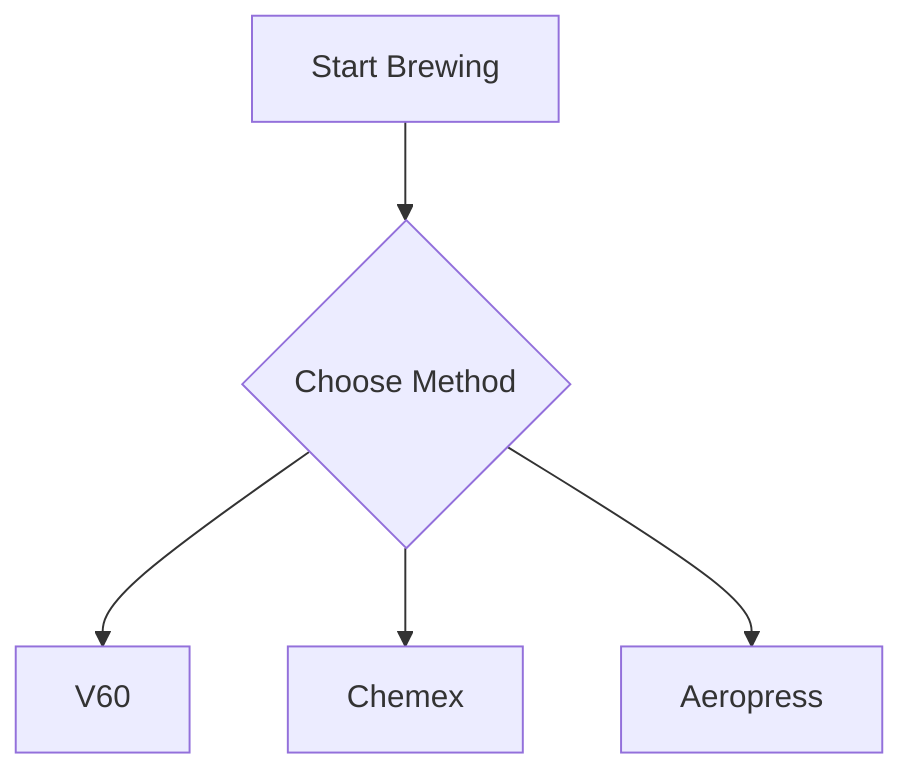

# ☕ Coffee Vault - Syntax and Standards Guide

**Version**: 4.0.0  
**Purpose**: Definitive reference for all syntax, formatting, and standards used throughout Coffee Vault  
**Audience**: Users, developers, AI assistants, contributors

---

## 🎯 Core Principles

1. **Consistency**: Same patterns throughout vault
2. **Clarity**: Obvious what code does
3. **Reliability**: Error handling everywhere
4. **Beauty**: Visual appeal in presentation
5. **Functionality**: Code blocks render as interactive elements

---

## 📝 Frontmatter Standards

### Required Properties (All Notes)

```yaml
---
type: coffee-log              # REQUIRED: Note type identifier
date: 2025-10-27              # REQUIRED: ISO date format (YYYY-MM-DD)
tags: [coffee-log, 2025-10]   # RECOMMENDED: Categorization
status: active                # OPTIONAL: active, archived, draft
---
```

### Property Naming Convention

**ALWAYS use kebab-case in frontmatter**:

✅ **Correct**:
```yaml
brew-method: v60
water-temperature: 94
flavor-notes: [chocolate, caramel]
```

❌ **Wrong**:
```yaml
brewMethod: v60           # camelCase - DON'T USE
water_temperature: 94     # snake_case - DON'T USE
flavor notes: [chocolate] # spaces - DON'T USE
```

### Complete Coffee Log Frontmatter Template

```yaml
---
type: coffee-log
date: 2025-10-27
time: 14:30
beans: Ethiopian Yirgacheffe
roaster: Blue Bottle
origin: Ethiopia
roast-level: light
brew-method: v60
grind-size: medium-fine
dose: 18
water: 300
brew-ratio: 1:16.7
water-temperature: 94
brew-time: 2:45
rating: 4.5
cups-brewed: 1
flavor-notes: [blueberry, jasmine, honey]
would-rebuy: true
status: active
tags: [coffee-log, 2025-10, ethiopia]
---
```

---

## 🔍 Query Syntax Reference

### DataviewJS (Primary - Works with Datacore)

**All queries should use `dataviewjs` blocks for maximum compatibility**:

```dataviewjs
// Basic query pattern
const logs = dv.pages('"Coffee Logs"')
  .where(p => p.type === "coffee-log")
  .sort(p => p.date, "desc")
  .limit(10)
  .array();

// Render table
dv.table(
  ["Date", "Beans", "Rating"],
  logs.map(p => [p.date, p.beans, p.rating])
);
```

### Query Patterns Library

#### Pattern 1: Basic Retrieval and Display

```dataviewjs
const items = dv.pages('"Folder Name"')
  .where(p => p.type === "note-type")
  .array();

if (items.length > 0) {
  dv.table(
    ["Column 1", "Column 2"],
    items.map(p => [p.property1, p.property2])
  );
} else {
  dv.paragraph("No items found.");
}
```

#### Pattern 2: Grouping and Aggregation

```dataviewjs
const logs = dv.pages('"Coffee Logs"').array();

// Group by a property
const groups = {};
logs.forEach(log => {
  const key = log["brew-method"] || "Unknown";
  if (!groups[key]) {
    groups[key] = { count: 0, totalRating: 0 };
  }
  groups[key].count++;
  groups[key].totalRating += log.rating || 0;
});

// Calculate and display
const results = Object.entries(groups)
  .map(([method, stats]) => [
    method,
    stats.count,
    Math.round((stats.totalRating / stats.count) * 10) / 10
  ])
  .sort((a, b) => b[2] - a[2]);

dv.table(["Method", "Count", "Avg Rating"], results);
```

#### Pattern 3: Date Filtering

```dataviewjs
// Current month
const now = new Date();
const currentMonth = now.getMonth();
const currentYear = now.getFullYear();

const thisMonth = dv.pages('"Coffee Logs"')
  .where(p => {
    if (!p.date) return false;
    const logDate = new Date(p.date.toString());
    return logDate.getMonth() === currentMonth &&
           logDate.getFullYear() === currentYear;
  })
  .array();

// Last 7 days
const sevenDaysAgo = new Date();
sevenDaysAgo.setDate(sevenDaysAgo.getDate() - 7);

const recent = dv.pages('"Coffee Logs"')
  .where(p => p.date && p.date >= dv.date(sevenDaysAgo))
  .array();
```

#### Pattern 4: Statistics Calculation

```dataviewjs
const values = dv.pages('"Coffee Logs"')
  .where(p => p.rating)
  .array()
  .map(p => p.rating);

// Calculate stats
const avg = values.reduce((a, b) => a + b, 0) / values.length;
const max = Math.max(...values);
const min = Math.min(...values);
const variance = values.reduce((sum, v) => sum + Math.pow(v - avg, 2), 0) / values.length;
const stdDev = Math.sqrt(variance);

dv.table(
  ["Statistic", "Value"],
  [
    ["Average", avg.toFixed(2)],
    ["Maximum", max],
    ["Minimum", min],
    ["Std Dev", stdDev.toFixed(2)]
  ]
);
```

#### Pattern 5: Null-Safe Property Access

**ALWAYS use null-safe patterns**:

```dataviewjs
// ✅ Safe - won't crash on missing properties
const logs = dv.pages('"Coffee Logs"').array();
logs.forEach(log => {
  const beans = log?.beans ?? "Unknown";
  const rating = log?.rating ?? 0;
  const method = log["brew-method"] || "Unknown";
});

// ❌ Unsafe - will crash if property missing
logs.forEach(log => {
  const beans = log.beans;  // Error if beans undefined
});
```

---

## 🎨 Markdown Formatting Standards

### Headers with Emoji

```markdown
# 📊 Main Section (H1 - Page Title)
## 🎯 Major Section (H2 - Primary Divisions)
### ☕ Subsection (H3 - Categories)
#### 📈 Detail Section (H4 - Specifics)
```

### Callouts (Obsidian Syntax)

```markdown
> [!info] Information
> This is an informational callout

> [!tip] Pro Tip
> Use medium-fine grind for V60

> [!warning] Watch Out
> Don't exceed 96°C for light roasts

> [!success] Great Job
> You've logged 100 brews!

> [!example] Example
> Here's a sample brew

> [!quote] Coffee Quote
> "Coffee is a language in itself." - Jackie Chan
```

### Custom Coffee Callouts

```markdown
> [!coffee] Brew Tip
> Specialty content for brewing advice

> [!bean] Bean Note
> Information about specific beans

> [!science] Coffee Science
> Scientific explanation or fact

> [!rating]+ Quality Assessment
> Rating and quality information (+ makes it expanded by default)
```

### Tables

```markdown
| Column 1 | Column 2 | Column 3 |
|----------|----------|----------|
| Data     | Data     | Data     |
| Data     | Data     | Data     |
```

**Alignment**:
- Left: `|:---------|`
- Center: `|:--------:|`
- Right: `|---------:|`

### Lists

**Unordered** (☕ theme):
```markdown
- Item one
  - Nested item
- Item two
```

**Ordered**:
```markdown
1. First step
2. Second step
3. Third step
```

**Task Lists**:
```markdown
- [ ] Incomplete task
- [x] Completed task
- [>] Forwarded task
- [<] Scheduled task
```

---

## 🔗 Linking Standards

### Wiki Links

```markdown
[[Note Name]]                    # Basic link
[[Note Name|Display Text]]       # Link with custom text
[[Folder/Note Name]]             # Full path
[[Note Name#Header]]             # Link to specific header
[[Note Name#^block-id]]          # Link to specific block
```

### Embeds

```markdown
![[Note Name]]                   # Embed entire note
![[Note Name#Header]]            # Embed section
![[Image.png]]                   # Embed image
![[Video.mp4]]                   # Embed video
```

### External Links

```markdown
[Display Text](https://url.com)
[Display Text](https://url.com "Hover tooltip")
```

---

## 🎨 CSS Class Usage

### Page-Level Classes (cssclass in frontmatter)

```yaml
---
cssclass: dashboard              # Dashboard styling
cssclass: reference-guide        # Reference document styling
cssclass: visualization          # Visualization page
cssclass: coffee-log             # Coffee log specific
cssclass: [dashboard, mobile]    # Multiple classes
---
```

### Inline CSS Classes

```markdown
<div class="coffee-card">
Content here
</div>

<span class="rating-badge">4.5⭐</span>
```

---

## 🔧 Templater Syntax

### Basic Template Structure (5 Sections)

```javascript
<%*
// ============================================
// SECTION 1: Configuration and Imports
// ============================================

const currentDate = tp.file.creation_date("YYYY-MM-DD");
const currentTime = tp.file.creation_date("HH:mm");

// ============================================
// SECTION 2: Helper Functions
// ============================================

function calculateRatio(dose, water) {
  return `1:${(water / dose).toFixed(1)}`;
}

// ============================================
// SECTION 3: Data Gathering (from vault)
// ============================================

const recentLogs = dv?.pages('"Coffee Logs"')
  .where(p => p.type === "coffee-log")
  .limit(5)
  .array() ?? [];

const suggestedBean = recentLogs[0]?.beans ?? "";

// ============================================
// SECTION 4: User Input (with smart defaults)
// ============================================

const beanName = await tp.system.prompt("Bean", suggestedBean);
const rating = await tp.system.prompt("Rating (1-5)", "4.0");

// ============================================
// SECTION 5: Output Generation
// ============================================
%>
---
type: coffee-log
date: <%= currentDate %>
beans: <%= beanName %>
rating: <%= parseFloat(rating) %>
---

# Content Here

<% tp.file.cursor() %>
```

### Important Templater Rules

**1. Call `tp.file.cursor()` EXACTLY ONCE**:
```javascript
✅ Correct: <% tp.file.cursor() %>  (only once)
❌ Wrong: Multiple tp.file.cursor() calls
```

**2. Use `<%* ... %>` for logic, `<%= ... %>` for output**:
```javascript
<%* const value = "test"; %>          // Logic block
<%= value %>                          // Output block
```

**3. Error handling required**:
```javascript
<%*
const data = await tp.user.someFunction().catch(() => null);
if (!data) {
  // Fallback logic
}
%>
```

---

## 📊 Code Block Types

### 1. DataviewJS (Interactive Queries)

**Syntax**:
````markdown
```dataviewjs
const logs = dv.pages('"Coffee Logs"').array();
dv.table(["Date", "Rating"], logs.map(p => [p.date, p.rating]));
```
````

**When to Use**:
- Dynamic data displays
- Calculated statistics
- Grouped analysis
- Interactive dashboards

### 2. Tracker (Visual Charts)

**Syntax**:
````markdown
```tracker
searchType: frontmatter
searchTarget: rating
folder: Coffee Logs
line:
    title: Coffee Rating Trends
    yMin: 0
    yMax: 5
```
````

**Chart Types**:
- `line`: Line charts for trends
- `bar`: Bar charts for comparisons
- `pie`: Pie charts for distributions
- `month`: Calendar heatmaps

### 3. JavaScript (Templater)

**Syntax**:
````markdown
```javascript
// Helper function
function calculateRatio(dose, water) {
  return `1:${(water / dose).toFixed(1)}`;
}
```
````

**When to Use**:
- Documenting logic
- Code examples
- Reference implementations

### 4. Mermaid (Diagrams)

**Syntax**:
````markdown

````

**Diagram Types**:
- `graph`: Flowcharts
- `sequenceDiagram`: Process flows
- `classDiagram`: Structure diagrams
- `gantt`: Timeline charts

### 5. Code Syntax Highlighting

**Languages**:
````markdown
```python
# Python code
print("Hello Coffee")
```

```bash
# Shell commands
cd Coffee\ Vault
ls -la
```

```json
{
  "property": "value"
}
```
````

---

## 🎨 Visual Design Standards

### Color Palette

**Coffee Theme Colors**:
- **Espresso**: `#2B1810` (Dark brown)
- **Dark Roast**: `#3E2723`
- **Medium Roast**: `#5D4037`
- **Light Roast**: `#8D6E63`
- **Cream**: `#FFF8E1`
- **Caramel**: `#D4A574`
- **Berry**: `#C62828` (Accent)
- **Citrus**: `#FF8F00` (Accent)

### Emoji Usage

**Standard Icons**:
- ☕ Coffee/brewing
- 🫘 Beans
- ⭐ Ratings
- 📊 Statistics/analytics
- 🎯 Goals/targets
- 🌍 Origins
- 🔬 Science
- 💡 Tips
- ⚠️ Warnings
- ✅ Success/complete
- 📈 Trends/growth
- 🏆 Excellence/best
- 🔧 Tools/techniques

**Consistent Usage**:
- Same emoji for same concept
- Don't overuse
- Professional appearance
- Functional not decorative

### Typography Hierarchy

```markdown
# Page Title (H1) - Used once per page
## Major Section (H2) - Primary divisions
### Subsection (H3) - Categories
#### Detail Section (H4) - Specifics
##### Minor Detail (H5) - Rare use
```

### Spacing and Formatting

**Sections**:
```markdown
## Section Title

Content here with proper spacing.

---

## Next Section
```

**Lists and Paragraphs**:
- Blank line before/after lists
- Blank line between paragraphs
- Consistent indentation (2 spaces)

---

## 🗂️ File Naming Conventions

### Coffee Logs

**Format**: `YYYY-MM-DD-Bean-Name-Index.md`

**Examples**:
- `2025-10-27-Ethiopian-Yirgacheffe-0.md`
- `2025-10-27-Colombian-Huila-1.md`

### Other Notes

**Format**: `Descriptive-Name-With-Hyphens.md`

**Examples**:
- `Brewing-Optimization-Engine.md`
- `Coffee-Varietals-Encyclopedia.md`
- `Monthly-Analytics-Dashboard.md`

### Bases

**Format**: `Descriptive-Name.base`

**Examples**:
- `All-Coffee-Logs.base`
- `Top-Rated-Brews.base`
- `By-Origin.base`

---

## 🔄 How Code Blocks Become Interactive

### The Rendering Pipeline

**1. Static Markdown** (what you write):
````markdown
```dataviewjs
dv.paragraph("Hello World");
```
````

**2. Plugin Processing** (Datacore/Dataview):
- Plugin detects `dataviewjs` code fence
- Executes JavaScript code
- Renders output to page

**3. Interactive Element** (what you see):
- Rendered table, list, or paragraph
- Live data from vault
- Updates when data changes
- Interactive and clickable

### Verification Code Blocks Render

**Checklist**:
- [ ] Datacore plugin installed and enabled
- [ ] "Enable JavaScript Queries" is ON in settings
- [ ] View note in Preview/Reading mode (not Source)
- [ ] Code fence syntax correct (` ``` ` not `~~~~`)
- [ ] No syntax errors in code
- [ ] Folder paths match exactly (case-sensitive)

### Common Rendering Issues

**Problem**: Code shows as text, not interactive

**Solutions**:
1. Check you're in Preview mode (not Edit/Source mode)
2. Verify plugin enabled: Settings → Community Plugins → Datacore
3. Enable JavaScript: Settings → Datacore → Enable JavaScript Queries ✅
4. Check syntax: Must be ` ```dataviewjs ` exactly
5. Restart Obsidian if just enabled plugins

---

## 📱 Responsive Design Standards

### Mobile-Optimized Queries

```dataviewjs
// Detect mobile (simulated - Obsidian doesn't expose this)
const isMobile = window.innerWidth < 768;

// Adjust display for mobile
if (isMobile) {
  // Fewer columns
  dv.table(["Beans", "Rating"], logs.map(p => [p.beans, p.rating]));
} else {
  // Full desktop view
  dv.table(
    ["Date", "Beans", "Roaster", "Rating", "Method"],
    logs.map(p => [p.date, p.beans, p.roaster, p.rating, p["brew-method"]])
  );
}
```

### CSS Responsive Classes

```css
/* Mobile-first approach */
.coffee-card {
  width: 100%;
}

@media (min-width: 768px) {
  .coffee-card {
    width: 50%;
  }
}

@media (min-width: 1024px) {
  .coffee-card {
    width: 33.333%;
  }
}
```

---

## 🎯 Dashboard Layout Patterns

### Standard Dashboard Structure

```markdown
---
type: dashboard
cssclass: dashboard
---

# Dashboard Title

> Brief description

## Section 1: Key Metrics

```dataviewjs
// KPI display
```

---

## Section 2: Detailed Analysis

```dataviewjs
// Detailed tables/analysis
```

---

## Section 3: Insights and Recommendations

**Insights**:
- Insight 1
- Insight 2

**Recommendations**:
- Action 1
- Action 2

---

## Related

- [[Link to related dashboard]]
- [[Link to reference]]
```

---

## 🔧 Bases Configuration

### Creating a Base

**Method 1: From Folder**:
1. Right-click folder → "Create base"
2. Select columns to display
3. Configure sorting/filtering
4. Save with `.base` extension

**Method 2: From Query**:
1. Command Palette → "Create new base"
2. Choose "Query-based"
3. Enter Dataview query
4. Configure columns
5. Save

### Base JSON Structure

```json
{
  "type": "base",
  "source": {
    "type": "folder",
    "path": "Coffee Logs"
  },
  "columns": [
    {
      "id": "date",
      "label": "Date",
      "type": "date",
      "width": 120,
      "visible": true
    }
  ],
  "sort": {
    "column": "date",
    "direction": "desc"
  },
  "groupBy": null
}
```

### Base Features

**Inline Editing**:
- Click any cell to edit
- Changes save to note frontmatter
- Real-time updates

**Aggregations**:
- Right-click column header
- Sum, Average, Count, Min, Max
- Appears at bottom of column

**Filtering**:
- Click filter icon in header
- Set conditions
- Combine multiple filters

**Grouping**:
- Drag column to "Group by" area
- Collapsible groups
- Per-group aggregations

---

## 🖼️ Embedding Visualizations

### Iframe Method (Webviewer Required)

```markdown
<iframe 
  src="app://local/Visualizations/flavor-compass.html" 
  width="100%" 
  height="700px" 
  style="border: none; border-radius: 8px;">
</iframe>
```

### Link Method

```markdown
[Open Flavor Compass](app://local/Visualizations/flavor-compass.html)
```

### Canvas Method

Create a `.canvas` file and drag HTML files onto canvas for visual layout.

---

## 📐 Property Schema Quick Reference

### Coffee Log Properties

**Required**:
- `type`: coffee-log
- `date`: YYYY-MM-DD
- `beans`: Bean name
- `brew-method`: Method used
- `rating`: 1.0-5.0

**Common**:
- `dose`: grams (10-100)
- `water`: grams (100-1000)
- `water-temperature`: Celsius (85-100)
- `grind-size`: extra-fine to extra-coarse
- `brew-time`: MM:SS format

**Optional**:
- `flavor-notes`: Array of flavors
- `roaster`: Roaster name
- `origin`: Country/region
- `roast-level`: light to dark
- `cups-brewed`: Integer

### Value Constraints

```yaml
rating: 1.0-5.0 (0.5 increments)
dose: 5-100 (grams)
water: 50-1000 (grams)
water-temperature: 85-100 (Celsius)
brew-method: [v60, chemex, aeropress, french-press, espresso, cold-brew, etc.]
grind-size: [extra-fine, fine, medium-fine, medium, medium-coarse, coarse, extra-coarse]
roast-level: [light, light-medium, medium, medium-dark, dark]
```

---

## 🎭 Error Handling Patterns

### Query Error Handling

```dataviewjs
try {
  const logs = dv.pages('"Coffee Logs"').array();
  
  if (logs.length === 0) {
    dv.paragraph("No coffee logs found. Create your first brew!");
    return;
  }
  
  // Process and display
  dv.table(["Date", "Rating"], logs.map(p => [p.date, p.rating]));
  
} catch (error) {
  dv.paragraph("⚠️ Error loading data: " + error.message);
  console.error(error);
}
```

### Template Error Handling

```javascript
<%*
try {
  const data = await someOperation();
} catch (error) {
  console.error("Template error:", error);
  // Provide fallback
  const data = defaultValue;
}
%>
```

---

## 🚀 Performance Best Practices

### Query Optimization

```dataviewjs
// ✅ Good - Limited scope
const logs = dv.pages('"Coffee Logs"')
  .limit(100)
  .array();

// ❌ Bad - Unbounded query
const logs = dv.pages('"Coffee Logs"').array();
```

### Caching Strategies

```dataviewjs
// Cache expensive calculations
const allLogs = dv.pages('"Coffee Logs"').array();

// Reuse cached result
const v60Logs = allLogs.filter(p => p["brew-method"] === "v60");
const chemexLogs = allLogs.filter(p => p["brew-method"] === "chemex");

// Don't re-query
// ❌ const v60Logs = dv.pages(...).where(...).array();
// ❌ const chemexLogs = dv.pages(...).where(...).array();
```

---

## 📋 Template Reference Library

### Coffee Log Template Pattern

```yaml
---
type: coffee-log
date: <%= tp.file.creation_date("YYYY-MM-DD") %>
beans: <%= beanName %>
rating: <%= parseFloat(rating) %>
---

# ☕ Coffee Log: <%= beanName %> | <%= tp.file.creation_date("YYYY-MM-DD") %>

## Brewing Parameters

- **Dose**: <%= dose %>g
- **Water**: <%= water %>g

<% tp.file.cursor() %>
```

### Bean Profile Template Pattern

```yaml
---
type: bean-profile
bean-name: <%= beanName %>
roaster: <%= roaster %>
origin: <%= origin %>
purchase-date: <%= tp.file.creation_date("YYYY-MM-DD") %>
---

# <%= beanName %>

## Origin Information

<% tp.file.cursor() %>
```

---

## 🔗 Cross-Referencing Best Practices

### Linking Coffee Logs to Beans

**In Coffee Log**:
```yaml
beans: [[Ethiopian Yirgacheffe]]  # Wiki link to bean profile
```

**In Bean Profile**:
```dataviewjs
// Show all logs using this bean
const thisBean = dv.current().file.name;
const logs = dv.pages('"Coffee Logs"')
  .where(p => p.beans === thisBean)
  .array();

dv.table(["Date", "Rating", "Method"],
  logs.map(p => [p.date, p.rating, p["brew-method"]])
);
```

### Block References

**Creating a Block ID**:
```markdown
This is important content. ^important-block
```

**Referencing It**:
```markdown
![[Note Name#^important-block]]
```

---

## 🎨 Advanced Styling

### Custom Callout Types

Create custom callouts with CSS:

```css
.callout[data-callout="coffee"] {
  --callout-color: 139, 69, 19;  /* Coffee brown */
  --callout-icon: coffee;
}
```

Usage:
```markdown
> [!coffee] Brew Tip
> Content here
```

### Table Styling

```markdown
| Column 1 | Column 2 |
|----------|----------|
| Data     | Data     |
{.styled-table}
```

With CSS:
```css
.styled-table table {
  border-collapse: collapse;
  width: 100%;
}
```

---

## 🧪 Testing and Validation

### Query Testing Checklist

- [ ] Open in Preview/Reading mode
- [ ] Query renders (not showing as code)
- [ ] Data displays correctly
- [ ] No error messages
- [ ] Updates when data changes
- [ ] Performance acceptable (<2 seconds)

### Template Testing Checklist

- [ ] Creates note successfully
- [ ] Prompts appear
- [ ] Frontmatter generates correctly
- [ ] Cursor placement works
- [ ] Suggestions populate
- [ ] No JavaScript errors in console

---

## 📚 Reference Examples

### Complete Working Query

```dataviewjs
// Comprehensive example with all best practices
const logs = dv.pages('"Coffee Logs"')
  .where(p => p.type === "coffee-log" && p.rating)
  .sort(p => p.date, "desc")
  .limit(50)  // Performance limit
  .array();

if (logs.length === 0) {
  dv.paragraph("📭 No coffee logs found. Start brewing!");
  return;  // Early return
}

try {
  // Safe property access
  const avgRating = logs.reduce((sum, p) => sum + (p?.rating ?? 0), 0) / logs.length;
  
  // Formatted output
  dv.header(3, "Coffee Statistics");
  dv.table(
    ["Metric", "Value"],
    [
      ["Total Brews", logs.length],
      ["Average Rating", avgRating.toFixed(2) + "⭐"],
      ["Date Range", `${logs[logs.length-1]?.date} to ${logs[0]?.date}`]
    ]
  );
  
} catch (error) {
  dv.paragraph("⚠️ Error: " + error.message);
  console.error("Query error:", error);
}
```

---

## 🎯 Quick Reference Card

### Common Operations

**Get all coffee logs**:
```javascript
dv.pages('"Coffee Logs"').where(p => p.type === "coffee-log").array()
```

**Current month logs**:
```javascript
const now = new Date();
dv.pages('"Coffee Logs"').where(p => {
  const d = new Date(p.date?.toString());
  return d.getMonth() === now.getMonth();
}).array()
```

**Group and count**:
```javascript
const groups = {};
logs.forEach(log => {
  const key = log.property;
  groups[key] = (groups[key] || 0) + 1;
});
```

**Calculate average**:
```javascript
const avg = values.reduce((a, b) => a + b, 0) / values.length;
```

**Safe property access**:
```javascript
const value = log?.property ?? "default";
const value2 = log["kebab-property"] || "default";
```

---

## 📖 Official Documentation Links

**Obsidian**:
- [Obsidian Help](https://help.obsidian.md)
- [Dataview Documentation](https://blacksmithgu.github.io/obsidian-dataview/)
- [Templater Documentation](https://silentvoid13.github.io/Templater/)
- [Bases Guide](https://help.obsidian.md/Plugins/Bases)

**Coffee Vault**:
- [[README]] - Overview
- [[START-HERE]] - Quick start
- [[Configuration/Property-Schema]] - Complete property reference
- [[VAULT-EXCELLENCE-ROADMAP]] - Implementation roadmap

---

## ✅ Standards Compliance Checklist

### For New Content

- [ ] Frontmatter follows kebab-case convention
- [ ] All required properties present
- [ ] Queries use `dataviewjs` blocks
- [ ] Error handling included
- [ ] Null-safe property access
- [ ] Performance limits on queries
- [ ] Emoji usage consistent
- [ ] File naming follows convention
- [ ] Proper header hierarchy
- [ ] Links use wiki-link format
- [ ] CSS classes appropriate

### For Existing Content Review

- [ ] Convert old Dataview to DataviewJS
- [ ] Add error handling
- [ ] Update property names to kebab-case
- [ ] Add performance limits
- [ ] Standardize emoji usage
- [ ] Fix broken links
- [ ] Update outdated patterns

---

## 🎓 Learning Path

**Beginner**:
1. Understand frontmatter basics
2. Learn wiki-link syntax
3. Read simple DataviewJS queries
4. Create notes from templates

**Intermediate**:
5. Write custom DataviewJS queries
6. Create bases for views
7. Customize templates
8. Use callouts effectively

**Advanced**:
9. Complex query logic
10. Template programming
11. CSS customization
12. Plugin integration

---

**This guide is the authoritative reference for all syntax and standards in Coffee Vault 4.0**

Use it to:
- Write consistent content
- Debug rendering issues
- Learn query syntax
- Maintain quality standards
- Onboard new contributors

---

**Version**: 4.0.0  
**Last Updated**: 2025-10-27  
**Status**: Living Document (update as standards evolve)

